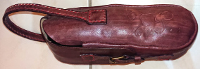

# TravailDuCuir

Dans ce dossier presente certains projets de maroquinerie. On y trouvera les patrons utilisé quelques conseils éventuels pour la fabrication. Les patrons peuvent être utilisé pour des projets personnels mais pas pour faire des pièces qui seront vendues sans autorisation préalable de l'auteur.

## Pièce présentent dans ce dossier

### Sacoche de boules de pétanque

## Recettes

### Colle de farine

Pour coller le cuir j'utilise une simple colle de farine. Cette colle permet est colle "faible", elle permet de coller deux bouts de cuir entre eux mais la fixation n'est pas très solide. Elle est suffisante pour le maintient afin de coudre ensuite les pièces de cuir.

Pour la préparer :

- 2-3 cuillères à soupe de farine
- 1 cuillère à caffé de sucre en poudre (optionnel)
- un verre d'eau

Tout mélanger dans une casserole et faire chauffer. Quand la préparation commence à épaissir, rajouter de l'eau si nécessaire pour obtenir la consistance voulue. Elle doit être visqueuse mais pas trop pour pouvoir être étalée.

Conserver la colle au frigot, elle se garde quelques jours.

### Encaustique

L'encaustique est composé de :

- une part de cire d'abeille
- une part d'essence de térébentine

On peut également rajouter de l'huile de lin.

L'encaustique est déposé en finition, il nourrit le cuir et sert à imperméabiliser le cuir. Plus on en met plus l'imperméabilisaiton sera efficace. Par contre si on en met trop sur du cuir souple, il peut craqueler et faire apparaitre des tâche blanches. La première couche peut être mise avec une brosse à dent souple ainsi il peut se déposer dans le couture pour les protéger. Ensuite on le frotte avec un tissu doux non pelucheux.

## Freecad

Pour creer un pdf avec le patron à l'échelle 1, on utilise freecad (logiciel de CAO open source). On commence par créer une nouvelle pièce (module part design), on défini la géométrie avec le module sketch, on extrude (il est nécessaire de faire une pièce 3D pour exporter un dessin en coupe de la pièce). Une fois la pièce terminée, on ouvre le module drawing et le dessin s'intègrea avec la fonction insérer une projection orthogonale (on choisit la bonne vue pour l'affichage), on décoche la checkbox Echelle/position auto et on force l'échelle à 1. 
Sélectionner la page (du drawing) et appuyer sur la valeur de Editable texts, puis sur le bouton avec les trois petits points, on peut alors modifier les champs de la cartouche.
Finnalement on créé le fichier pdf via Fichier->Expoter au format pdf.