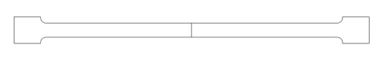
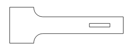
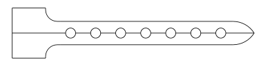
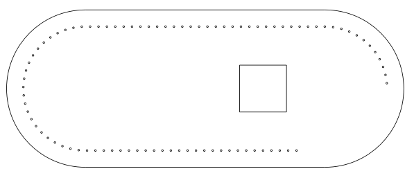
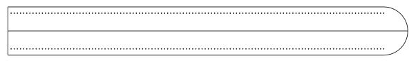

# Sacoche de boules de pétanques

Ce dossier contient des patrons (fait à l'aide du logiciel freecad) pour découper les pièces permettant de monter une sacoche de boules de pétanques en cuir souple. Cette sacoche a été conçu pour des boules de 74 mm de diamètre.

## Matériel

- [Cuir de basane](https://www.decocuir.com/peau-cuir-basane-tannage-vegetal-france-065-c2x36476475)
- [Teinture acajou](https://www.decocuir.com/teinture-base-aqueuse-eco-flo-130ml-acajou-fonce-dark-mahogany-c2x35737638)
- [Fil de lin rouge](https://www.decocuir.com/fil-lin-cartonnette-15m-couture-mercerie-cuir-c2x36667080)
- [Fil de lin marron chocolat](https://www.decocuir.com/fil-lin-carde-cire-poisse-c2x36667077)
- [Boucle à rouleau](https://www.decocuir.com/boucle-a-rouleau-a-ardillon-laiton-vieilli-15-mm-c2x36300452) couleur laiton vieilli

## Pièces

Dans cette section on montre les patrons des différentes pièces composant la sacoche. Les fichiers des patrons peuvent être retrouvés dans le dossier [Patrons](./Patrons).

Attentions, les images insérées dans ce document ne sont pas à l'échelle, pour des patrons à l'échelle il faut utiliser les fichiers pdf du dossier Patrons.

Des lignes droites peuvent apparaître au milieu des patrons, ces lignes sont des lignes de symétrie qui reste affiché lors de la mise en plan.

### Anse

On a mis deux fichiers de patrons pour la anse car la dimension est supérieur à une feuille A4. Le fichier [Demi anse](./Patrons/Demi_anse.pdf) donne le patron de la moitié de la anse qui tient sur une page A4, il faudra l'imprimer deux fois et scotché bout à bout les deux parties. Sinon dans le fichier [Anse](./Patrons/Anse.pdf) on a mis la anse totale (elle dépasse légèrement du cadre) qu'il faudra imprimer sur une feuille A3.

La anse fait 400 mm de long pour 16 mm de large. Les pads sont des carrés de 30x30 mm.

### Support de boucle

Lien vers le [patron](./Patrons/Support_de_boucle.pdf) du support de boucle.

### Sangle

Lien vers le [patron](./Patrons/Sangle.pdf) de la sangle.

Pour plus de solidité (et avoir de la fleur de chaque côté de la anse) nous l'avons doublé. Dû à la souplesse du patron en papier et du cuir les deux pièces ne sont pas très bien superposées, il a donc fallu les égaliser après collage (avant couture).

### Côté

Lien vers le [patron](./Patrons/Cote.pdf) du côté.

Attention pour les deux côtés de la sacoche sont simétriques, donc pour ce qui concerne la couture il faut utiliser le patron dans un sens pour le côté gauche et dans l'autre pour le côté droit.

On a mis une distance de 10 mm entre le bord de la pièce et la ligne de couture. Les points de couture sont espacés de 5 mm. Le carré représente le positionnement de la anse sur cette pièce, la dimension est légèrement inférieur (de 2 mm) au bout de la anse pour donner un indicateur de dépose de colle et ne pas avoir de marque qui peuvent dépasser de la anse une fois fixé. 

### Pourtour

Le pourtour est la plus grande pièce du projet. Elle fait environ 640 mm de long, soit deux longueurs de feuille A4 plus l'arrondi. Le patron est donc enregistré au [format A3](./Patrons/Pourtour_A3.pdf) en plusieurs parties. Il faudra les scotcher bout à bout. Le patron au [format 4A](./Patrons/Pourtour_A4.pdf) montre la pièce complète.

On a mis une distance de 10 mm entre le bord de la pièce et la ligne de couture. Les points de couture sont espacés de 5 mm.

## Montage

La anse étant faite dans le même cuir que tout le reste, on l'a doublé pour augmenter sa solidité. Il faut donc découper deux fois le patron de la anse, coller les deux parties ensemble puis les coudres avec un point sellier. Ne pas oublié le travail des tranches (abat carre, ponsage, gomme adragante).

Pour le support de boucle, il préférable de parer la partie à coller pour fixer la boucle. Une fois collée, on coud pour la solidité. Sur le patron, l'enchapure n'a pas les boûts arrondis, on peut le faire à l'emporte pièce. Il n'y a pas de patron à l'heure actuelle, mais il est également préférable de faire un passant. Ce passant doit être mis sur le patron avant la mise en place de la boucle.

Les côtés doivent être découpés en deux exemplaires. La anse est fixée sur chaque côté puis cousue. Une fois ceci effectué, on coud les côtés et le pourtour. Les côtés et le pourtoure doivent être cousu à l'envers (face teinte l'une contre l'autre), le perçage s'effectue avec une alène ronde. Le couture est doublée (type point sellier avec deux aiguilles). Cette couture a été faite avec le fil marron pour qu'elle soit discrète (toutes les autres coutures ont été faite au fil rouge).

Une fois la couture fini, on retourne la sacoche pour qu'elle soit à l'endroit.

Pour la permière sacoche, le support de boucle et la sangle ont été fixés et cousu après cette couture pour bien les positionner. Si les patrons était bien maitrisés on pourrai le faire avant.

### Remarques

Le pourtour est un peu grand et peut être réduit d'un ou deux centimètres.

La sangle est un peu grande et peut être réduit d'un centimètre.

Attention, le nombre de trou pour la couture des côté et du pourtour n'est pas maitrisé. Ces trous n'ont pas été marqués à l'alène sur la fleur mais au marqueur sur la croute. Les trous ont été percés au fur et à mesure puis quand la couture a été jugé suffisament haute (et pas trop) on s'est arrêté. Remonter un quart du demi-cercle supérieur des côtés est suffisant voir un peu trop.

## Photos 

Différentes photos du porjet sont enregistrées dans le dossier [Photos](./Photos).

